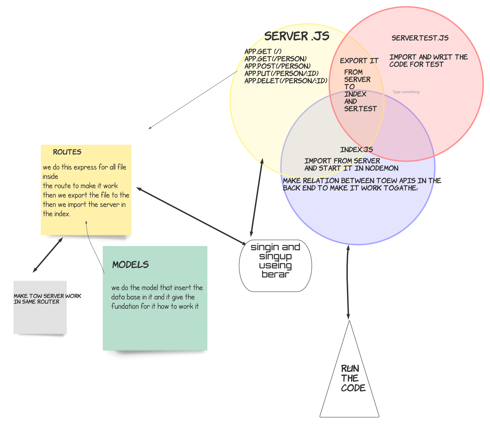

# auth-api

## notes 

1. we learn about SQL
2. download 
    >"pg": "^8.7.1",

    >"sequelize": "^6.6.5",

    >"sequelize-cli": "^6.2.0",

    >"sqlite3

    > auth for singin 

3. new command for data base 

4. Install The Postgres Database Server 

5.  how to make singin and singup for data base

6. berar to stay loged in 
7. tow server in one router 

## deployment links

- qusai-auth-api --> [repo](https://github.com/qusaiqeisi/auth-api)
- PR --> [pull requist](https://github.com/qusaiqeisi/auth-api/pull/1)
- repo action -->[action](https://github.com/qusaiqeisi/auth-api/actions)
- heruko --> [heruko](https://qusaiqeisi-bearer-auth.herokuapp.com/)

## MUL

